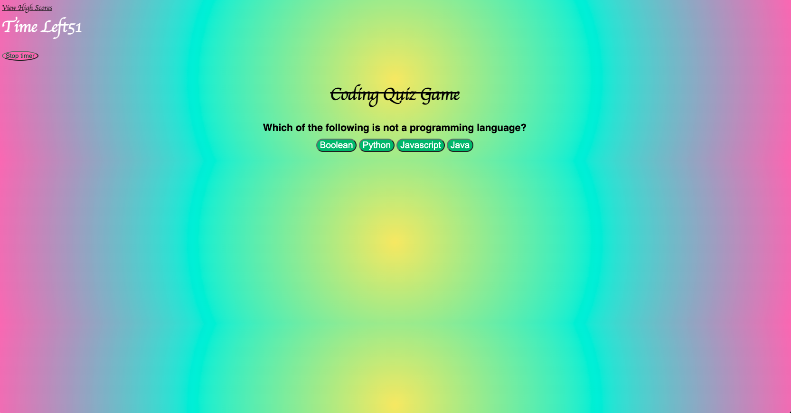

# Code Quiz

## Description
This is a timed Code-Quiz app that will test your knowledge by asking you a series of multiple choice coding related questions in 60 seconds. The goal is to complete as many as you can before the timer runs out. 
## Table of Contents 
  - [Code Quiz](#code-quiz)
  - [Description](#description)
  - [Screenshots](#screenshots)
  - [License](#license)
  - [Contributing](#contributing)
  - [Questions](#questions)

# Screenshots

## License
This project is licensed under the MIT license.

## Contributing
Chase Stratton  

## Questions
If you have any questions about the repo, open an issue or contact [Chasek6](undefined) directly at quranstratton@gmail.com.
